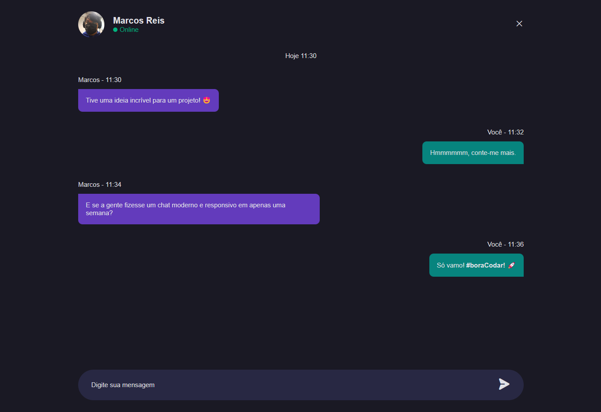

# Dev Chat
Chat desenvolvido no Desafio #04 do BoraCodar da Rocketseat.
<p align="center">
  
</p>

[Clique aqui para acessar](https://marqueba.github.io/dev-chat/)

## 🚀 Tecnologias

Esse projeto foi desenvolvido com as seguintes tecnologias:

- ``HTML e CSS``
- ```JavaScript```
- ``Git e Github``

## 🛠️ Funcionalidades Adicionais

- ``Responsividade desenvolvida de acordo com a metodologia Mobile-First``

## Contato

| [<br><sub>Marcos Reis Dutra</sub>](https://github.com/Marqueba)
